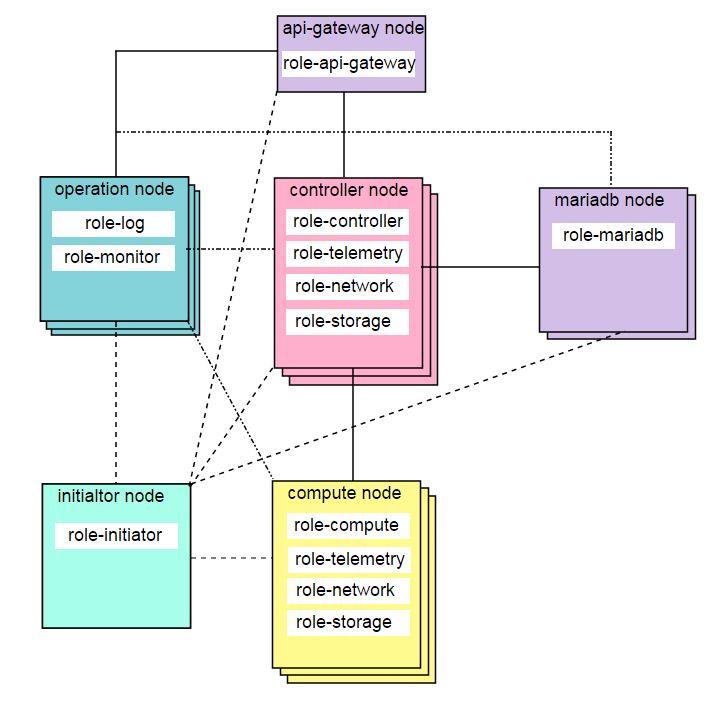

The relation of host and roles is as follow:

Every role contains several services as follow:

### role-initiator 
 - etcd
 - git-server
 - docker-registry
 - yum
 - Filebeat
 - cAdvisor
 - node exporter

### role-api-gateway
 - Horizon
 - API SSL Proxy
 - Web UI SSL Proxy
 - Filebeat
 - cAdvisor
 - node exporter

### role-controller
 - HAProxy
 - rabbitmq
 - keystone
 - glance
 - nova
 - cinder
 - neutron
 - ceilometer
 - etcd
 - Filebeat
 - cAdvisor
 - node exporter

### role-telemetry
 - HAProxy
 - ceilometer
 - mongodb
 - Filebeat
 - cAdvisor
 - node exporter

### role-mariadb
 - HAProxy
 - mariadb
 - Filebeat
 - cAdvisor
 - node exporter

### role-compute
 - nova
 - neutron
 - ceilometer
 - Filebeat
 - node exporter

### role-storage
 - cinder
 - Filebeat
 - cAdvisor
 - node exporter

### role-network
 - neutron
 - Filebeat
 - cAdvisor
 - node exporter
