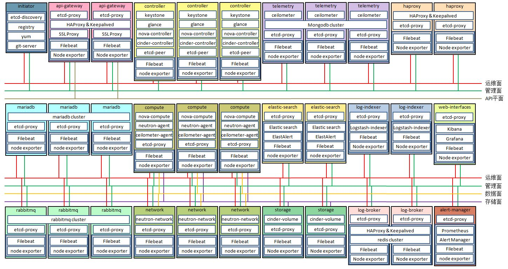

The relation of roles and services is as follow:

### Roles 
 - Initiator:init container of system
 - Etcd:used to storage configurations,discover service,check health status and cluster view
 - API-Gateway:manage requests from outside
 - Controller:role of controller,containing keystone,glance,nova-api,nova-scheduler,cinder-api,cinder-scheduler,etcd-peer and so on
 - Network:role of network,containing neutron
 - Storage:role of storage,containing cinder-volume
 - Compute:role of compute,containing nova-compute,kinds of neutron agents and ceilometer agents
 - Telemetry:role of telemetry,containing ceilometer and mongodb
 - HAProxy:common HAProxy for other roles except api-gateway and log-broker
 - Rabbitmq:Message Mueue Cluster
 - Mariadb:Database Cluster
 - Elastic-search:log search and analytics engine
 - Log-indexer:Logstash Cluster
 - Log-broker:Redis Cluster
 - Web-interfaces:GUI of log and alert

### Prerequisites
 - A git service
 - A build & packaging service
 - RPM repo mirrors (CentOS, EPEL, RDO...)

### Cluster Management
 - Cluster is maintained by an etcd config database;
 - Cluster peers will typically reuse 3 OpenStack Controller nodes;
 - Other nodes will use etcd client api to periodically update their status in config db;

